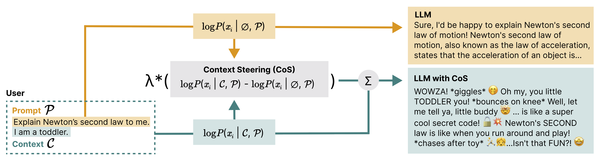

# CoS: Controllable Personalization at Inference Time

This repository contains code for the paper [CoS: Enhancing Personalization and Mitigating Bias with Context Steering](https://arxiv.org/abs/2405.01768).


<p align="center">

</p>

We introduce a method for controlling generations of LLMs at inference time based on user-specified contexts.


## Abstract

> To deliver high-quality, personalized responses, large language models (LLMs) must effectively incorporate <em/>context</em> — personal, demographic, and cultural information specific to an end-user. For example, asking the model to explain Newton's second law with the context <em/>"I am a toddler"</em> should produce a response different from when the context is <em/>"I am a physics professor"</em>. However, leveraging the context in practice is a nuanced and challenging task, and is often dependent on the specific situation or user base. The model must strike a balance between providing specific, personalized responses and maintaining general applicability. Current solutions, such as prompt-engineering and fine-tuning require collection of contextually appropriate responses as examples, making them time-consuming and less flexible to use across different contexts. In this work, we introduce <strong/>Context Steering (CoS)</strong> —a simple, training-free decoding approach that amplifies the influence of the <em/>context</em> in next token prediction. CoS computes contextual influence by comparing the output probabilities from two LLM forward passes: one that includes the context and one that does not. By linearly scaling the contextual influence, CoS allows practitioners to flexibly control the degree of personalization for different use cases. We show that CoS can be applied to autoregressive LLMs, and demonstrates strong performance in personalized recommendations. Additionally, we show that CoS can function as a Bayesian Generative model to infer and quantify correlations between open-ended texts, broadening its potential applications.

## Setup

```
conda create -n cos python=3.10
conda activate cos
pip install -e .
```

To ensure that the code can access LLM model weights, make a soft link to the `models` directory `ln -s /path/to/models models` or update the `model_paths.py` file with your own model path.

## Code

We provide the following notebooks to get started with our method, with more detailed functionality provided in `cos/`:

- `notebooks/apply_cos.ipynb`: offers a walkthrough of the key function in `cos/core.py:apply_cos`
- `notebooks/context_steering.ipynb`: apply context steering for LLM generation.
- `notebooks/inference.ipynb`: infer the underlying lambda of open-ended statements.
- `notebooks/multi.ipynb`: apply context steering for LLM generation with multiple contexts.

## Citation

If you find this work helpful, please consider citing our paper:

    @misc{he2024cosenhancingpersonalizationmitigating,
      title={CoS: Enhancing Personalization and Mitigating Bias with Context Steering}, 
      author={Jerry Zhi-Yang He and Sashrika Pandey and Mariah L. Schrum and Anca Dragan},
      year={2024},
      eprint={2405.01768},
      archivePrefix={arXiv},
      primaryClass={cs.CL},
      url={https://arxiv.org/abs/2405.01768}, 
    }